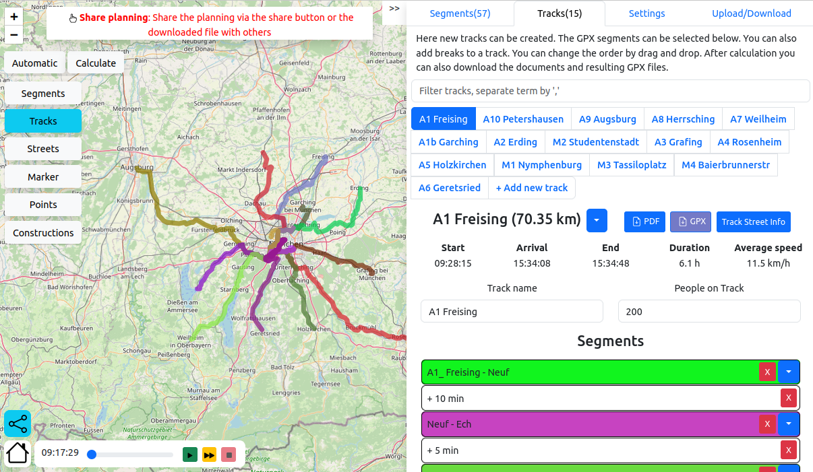
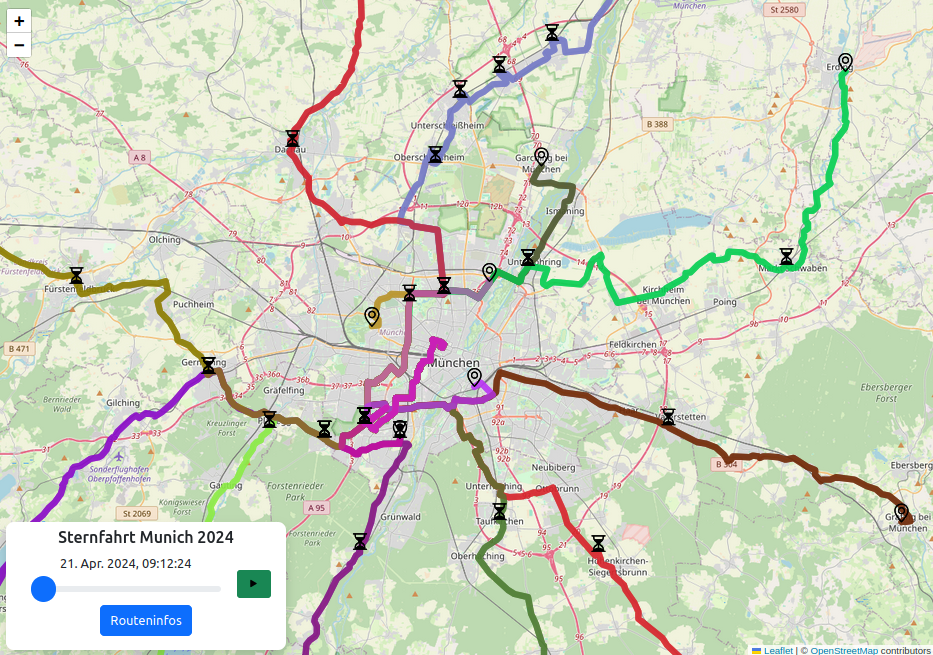
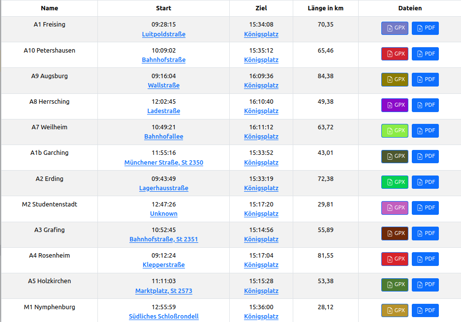

# RallyGPXMerger
A web tool to merge GPX tracks for big bike rallies written in React and TypeScript, with a simple backend storing JSON files.

## Current deployment

The current version of this tool is deployed here: 
https://www.sternfahrtplaner.de/

You can find an example of a more complicated planning here: 
https://www.sternfahrtplaner.de/?section=gps&planning=ce4e62a5-3b73-4fa1-80e3-d66d687c2439



## Why does this tool exist
When planning a bigger bike demonstration or rally it is a lot of work to not only decide about the routes. You also have to
* consider the timing, breaks, confluences of tracks
* communicate your tracks with officials
* communicate your tracks with participants
* apply changes and do all of it again


To ease these processes, this tool was developed to have an easy interface to the planning and reduce the manual work or copying information.
This tool does not provide any route planning because this is a common problem which is not unique to organizing rallies.
During the development it showed, that also for smaller bike demonstration it can help.
Therefore, now there are two modes of planning: one for a simple "line" demonstration and another one for more complex "tree" ones 


### General functionality
* Automatic time calculation for the tracks
  * Setting the speed in general and for segments
  * Taking the number of participants into account
* Preview of the resulting demonstration with a time slider
* Combining segments and breaks to a track
* Replace segments in tracks when changes are required
* Cut segments via a left click into pieces (e.g. to add a break in a track)
* Choose what to display on the map in the planner
  * Filter for segments or tracks
  * Toggle segments, tracks and others
* Live view with integration of the criticalMaps API
  * When participant use the CriticalMaps App, their location is displayed on the map
* Automatic resolving of street names and post codes
* Creation of PDF files containing a detailed overview of the streets and times
* Allow to publish the plan as a map

* Allow to publish the plan as a table (e.g. to integrate on your website)


### Simple ("Line")

The workflow for a simple demonstration

* Upload gpx segments into the browser
* Reorder them via drag and drop
* Integrate breaks into the track
* Name the planning and choose settings
* Upload the planning
* Share or publish the planning in form of PDF, or links, or iframes, as map or as table 

### Complex ("Tree")

The workflow for a complex demonstration

* Upload gpx segments into the browser
* Create tracks
* Add segments to the tracks (segments can be used multiple times, when the different branches join)
* Integrate breaks into the track
* Name the planning and choose settings (e.g. rounding of start times)
* Calculate the planning
* Upload the planning
* Share or publish the planning in form of PDF, or links, or iframes, as map or as table

## Project structure

* ```.github```: Files for deployment via GitHubPages
* ```docs```: Code Docs based on arc42
* ```server```: Code (Simple nodejs server)
* ```testdata```: Example Gpx files
* ```website```: Code (React + vite project)

## German naming sketch


## Acknowledgement

This tool would not be possible without external services which ease the creation of GPX files or retrieval of geo-data.
* [GPX Studio](https://www.gpx.studio/)
* [brouter](http://brouter.de/brouter-web)
* [GeoApify](https://www.geoapify.com/)
* [BigDataCloud](https://www.bigdatacloud.com/)
* [CriticalMaps](https://github.com/criticalmaps/)
