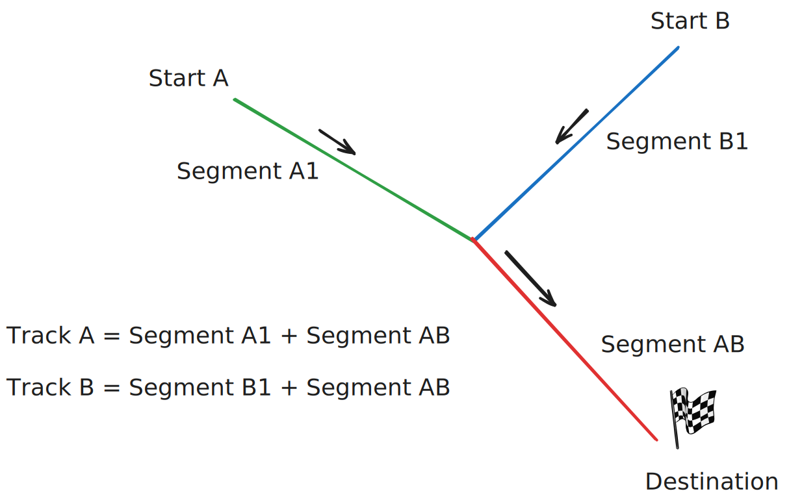
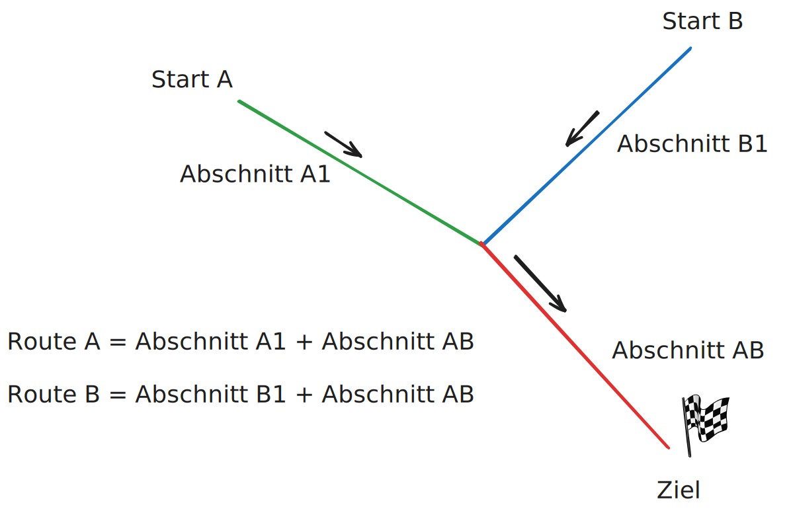

# RallyGPXMerger
A web tool to merge GPX tracks for big bike rallies written in React and TypeScript. Once the code is pushed to main, it is deployed.



## Current deployment
https://sebastianhanfland.github.io/RallyGPXMerger/

## Functionality
For organizing a rally, it is helpful to automate the time calculation for the different routes.

### Workflow

#### Calculating routes
* Uploading gpx segments into the browser
  * A segment is only a route from A to B and can be used by multiple groups
  * When adding the numbers of participants, a delay is added when two or more tracks join each other
* Defining routes based on segments, including breaks
* Setting the target time for the final point
* Then starting the calculation of the times
* Downloading/Saving the resulting routes

#### Resolving the streets and post codes

* Requirement: the routes are calculated
* In the third section you can fetch external data to resolve the positions to streets
  * this sends data to geoapify and BigDataCloud
* A list for each track and a summary of blocked roads can be downloaded
  * Unknown section can be filtered for and can be displayed on the map

## Project structure

* ```.github```: Files for deployment via GitHubPages
* ```docs```: Code Docs based on arc42
* ```testdata```: Example Gpx files
* ```website```: Code (React + vite project)

## German naming sketch


