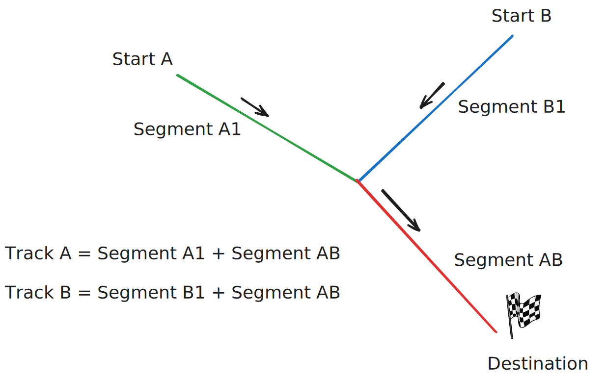

# Introduction and Goals

This tool aims to merge gpx segments (without timestamps) into track.
Each track consists of one or multiple segments.
The user can specify extra metadata like number of people or expected finish time.

A plan consists of multiple segments. These are put together to form tracks.
The tool takes into account that the different tracks have people on them with an expansion.
The average speed is adjusted and the times within the gpx files is set.
Eventually a pdf with an overview of the tracks and blocked streets can be created.

## Requirements Overview

While planning a rally, the route is something easy to plan, with tools like google, https://gpx.studio or http://brouter.de/brouter-web.
The problem this tool solves, is to calculate the times for a rally, e.g. when each branch should start.
All related information should also be accessible without manual work.

## Quality Goals

A person without a lot of technical knowledge should be able to easily use the tool.
No code needs to be installed to use the functionality.

## Stakeholders

| Role/Name  | Expectations                                     |
|------------|--------------------------------------------------|
| User       | Planing a rally easily with merging gpx segments |
| Maintainer | Being able to maintain the code long term        |
